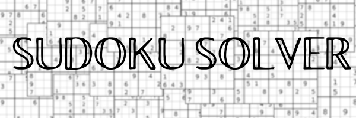

## About this project

This sudoku solver uses brute force, or exhaustive search, in order to find the solution for the puzzle.

It locates the first empty square, and inserts the first possible number from 1-9 on it. It repeats the process until it finds a square where no numbers fit. When that happens, it goes back, adds one to the last mutable square, and repeats the process until the board is filled.

In computer science, brute-force search or exhaustive search, also known as generate and test, is a very general problem-solving technique and algorithmic paradigm that consists of systematically checking all possible candidates for whether or not each candidate satisfies the problem's statement.

Please contact me if you find a board it cannot solve, or any other issue.

## Instructions

- Git Clone this repo;

- Run the program by using one of the following options:

    - `make run` will make it go at it's default speed;
    - `make slow` will make it go slower;
    - `make fast` will make it to go faster;
    - There is also a fourth and the fastest option, `make now`. My program uses the _usleep_ function in order to make the printing visible on the screen, and the `make now` option sets that value to zero.

- Follow the instructions displayed to insert values into your board;

- Watch it go as it solves your puzzle! 🛹

Keep in mind that as this is an exhaustive search algorithm, some puzzles might take a while (hours maybe), even if you selected make now.

## Running

Here it is in action:

## Regarding impossible boards

It will test all possible solutions, even on impossible boards, like for example this one:

There is no place for a 1 in the third square, as the only possible location for it is already occupied with a 5.

The program will still try to solve it, eventually stating the board is impossible as it tries every possible combination.

--------
LinkedIn: https://www.linkedin.com/in/pedrosmpm
